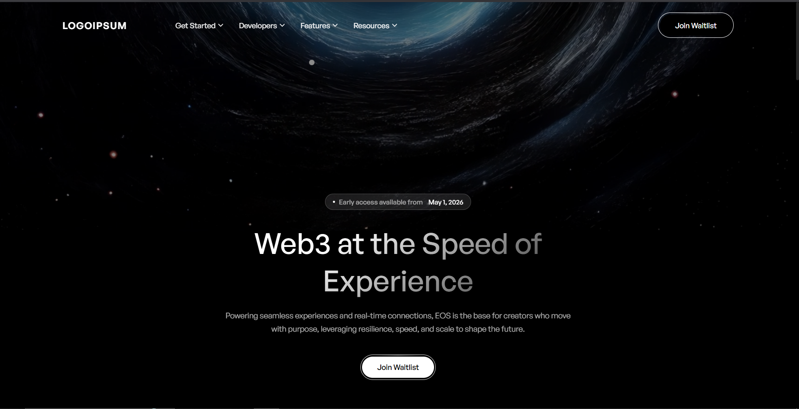

# Obsidian — Web3 Landing Page

A fully static, zero-dependency Web3 landing page. Three files. No npm, no bundler, no framework — just HTML, CSS, and a small vanilla JS file you can read in five minutes.

Built around a strict dark aesthetic: pure black background, white typography, glassy cards, and animations that feel intentional rather than decorative.

---

## Preview

[](https://obsidian-landing.vercel.app/)

  

---

## Stack

| Layer | What |
|---|---|
| Font | [General Sans](https://www.fontshare.com/fonts/general-sans) via Fontshare CDN |
| Styling | Vanilla CSS — no Tailwind, no preprocessor |
| JS | ~150 lines of vanilla JS (IntersectionObserver, no libraries) |
| Build | None. Open `index.html` in a browser. |

---

## File Structure

```
freeweb-v1/
├── index.html   # All markup, seven sections
├── styles.css   # ~600 lines, every style in one place
└── main.js      # Scroll-reveal, micro-interactions, counter animation
```

---

<details>
<summary><strong>🚀 Get Started</strong></summary>

<br>

### Run locally

No install step required. Clone the repo and open the file.

```bash
git clone https://github.com/your-username/freeweb-v1.git
cd freeweb-v1
```

Then open `index.html` in any modern browser.

If you want live-reload during editing, you can use the VS Code Live Server extension or Python's built-in server:

```bash
# Python 3
python -m http.server 3000
# Then visit http://localhost:3000
```

---

### Swap out the hero video

The background video is loaded from a CloudFront URL. To use your own:

1. Replace the `src` attribute on the `<video>` tag in `index.html`:
   ```html
   <video
     class="hero__video"
     src="YOUR_VIDEO_URL_HERE"
     autoplay muted loop playsinline
   ></video>
   ```
2. Keep it **muted** — browsers block autoplay on videos with sound.
3. H.264 MP4 works everywhere. Keep it under 10MB for fast load.

---

### Change the brand name

Search for `EOS` and `LOGOIPSUM` in `index.html` and replace with your own. The logo renders as a text wordmark by default, or swap in an `` tag pointing to your SVG.

---

### Color scheme

Everything inherits from two CSS variables at the top of `styles.css`:

```css
:root {
  --black: #000000;
  --white: #ffffff;
  --hero-gradient: linear-gradient(144.5deg, #ffffff 28%, rgba(0,0,0,0) 115%);
}
```

Accent colours live only in the syntax highlighter. Update `--hero-gradient` to shift the heading and metric number fills.

---

### Deploy

It's a static site — deploy anywhere:

- **Vercel**: drag the folder into the dashboard, done.
- **Netlify**: same.
- **GitHub Pages**: push to `main`, enable Pages, point it at the root.

</details>

---

<details>
<summary><strong>👩‍💻 Developers</strong></summary>

<br>

### How the scroll-reveal works

`main.js` uses a single `IntersectionObserver` watching every `.reveal` element. When 12% of the element enters the viewport, the `visible` class is added. CSS does the rest — opacity from 0 → 1 and translateY from 40px → 0 over a 0.7s ease-out curve.

```js
const revealObserver = new IntersectionObserver(
  (entries) => {
    entries.forEach((entry) => {
      if (entry.isIntersecting) {
        entry.target.classList.add('visible');
        revealObserver.unobserve(entry.target); // fire once, then clean up
      }
    });
  },
  { threshold: 0.12, rootMargin: '0px 0px -40px 0px' }
);
```

To make any new element animate in, just add the `reveal` class to it in HTML. Stagger delay is calculated automatically based on sibling index.

---

### Adding a new section

1. Write your HTML in `index.html` — copy an existing section as a starting point.
2. Add `.reveal` to the elements you want to animate in.
3. Add matching styles to `styles.css`. Follow the existing naming convention: `.section-name__element`.
4. If the section needs JavaScript behaviour, add a focused `init*` function in `main.js` and call it from `init()` at the bottom.

---

### Glass card recipe

The `.glass-card` class is reusable anywhere:

```css
.glass-card {
  background: linear-gradient(160deg, rgba(255,255,255,0.03) 0%, rgba(255,255,255,0.01) 100%);
  border: 1px solid rgba(255,255,255,0.05);
  box-shadow: inset 0 1px 0 0 rgba(255,255,255,0.1);
  border-radius: 16px;
}
```

On hover, border opacity goes to `0.12` and the inset shadow to `0.18`. The card lifts `-4px` on the Y axis. The subtle mouse-tracking tilt in `main.js` adds up to 4° of rotation depending on cursor position.

---

### Syntax highlighter

The code editor in the Developer section uses hand-written `<span>` tags — no library. The colour palette:

| Token | Colour |
|---|---|
| Keywords (`import`, `const`, `async`) | `#f07178` |
| Classes / types | `#e5c07b` |
| Strings | `#c3e88d` |
| Comments | `#6b7280` |
| Booleans, properties | `#89ddff` |
| Functions | `#82aaff` |
| Numbers | `#f78c6c` |
| Punctuation | `rgba(255,255,255,0.45)` |

To update the code snippet, edit the `<pre>` block inside `.code-editor__body` in `index.html`. Wrap tokens in the appropriate `<span class="c-*">` class.

---

### Performance notes

- The hero video autoplays muted — `main.js` catches the rejected promise silently if the browser blocks it.
- `IntersectionObserver` entries are `unobserve`d after triggering, so there's no continuous observation overhead.
- The ticker marquee is pure CSS animation — no JS, no `requestAnimationFrame` loop.
- The SVG fractal noise texture on the code editor is inline. It's ~200 bytes and rendered by the GPU.

</details>

---

<details>
<summary><strong>✦ Features</strong></summary>

<br>

### Visual

- **Fullscreen looping hero video** with a 50% black overlay and a 300px gradient that bleeds into the next section
- **Gradient text** — a precisely angled (`144.5deg`) white-to-transparent fill applied via `background-clip: text` on all major headings and metric numbers
- **Glass cards** — layered gradients, inset box-shadows, and a border that brightens on hover
- **Radial blur accents** — soft white `blur(80px)` blobs tucked in the corners of large feature cards
- **CSS grid background** on the developer section — 40px squares at 3% opacity, masked to a radial gradient so they fade at the edges
- **SVG fractal noise** on the code editor for texture depth

---

### Animations

- **Scroll-reveal** — every section element slides up 40px and fades in as it enters the viewport. Siblings stagger by 80ms.
- **Infinite ticker** — pure CSS `transform: translateX` loop. Pauses on hover.
- **Card tilt** — mouse-tracking 3D tilt on feature cards (max 4°, resets with spring easing on leave)
- **Pill button glow** — the white top-edge glow streak follows the cursor horizontally
- **Metric counters** — numbers count up from zero when the section enters the viewport
- **Scroll progress bar** — a 2px white line at the very top of the page that fills as you scroll
- **Cursor follower** — a 10px translucent dot that trails the cursor with a 60ms lag

---

### Responsive

- Nav links collapse on mobile (< 768px)
- Hero heading drops from 56px → 36px
- Bento grid collapses from 3-column to single-column
- Metrics banner stacks vertically
- Footer stacks vertically with centered links

</details>

---

<details>
<summary><strong>📚 Resources</strong></summary>

<br>

### Design references

- [Fontshare — General Sans](https://www.fontshare.com/fonts/general-sans) — the typeface used throughout
- [CSS `background-clip: text`](https://developer.mozilla.org/en-US/docs/Web/CSS/background-clip) — MDN reference for the gradient text technique
- [Intersection Observer API](https://developer.mozilla.org/en-US/docs/Web/API/Intersection_Observer_API) — how the scroll-reveal is wired
- [`backdrop-filter`](https://developer.mozilla.org/en-US/docs/Web/CSS/backdrop-filter) — used on the metrics banner
- [CSS `mask-image`](https://developer.mozilla.org/en-US/docs/Web/CSS/mask-image) — used to fade ticker edges and the grid background

---

### Tooling (optional)

None of these are required, but useful if you start extending the project:

| Tool | Use |
|---|---|
| [VS Code Live Server](https://marketplace.visualstudio.com/items?itemName=ritwickdey.LiveServer) | Hot reload during editing |
| [Squoosh](https://squoosh.app/) | Compress any images before adding |
| [HandBrake](https://handbrake.fr/) | Re-encode hero video to H.264 for maximum compatibility |
| [SVGOMG](https://svgomg.net/) | Optimize SVG icons before inlining |

---

### Browser support

Tested in Chrome 120+, Firefox 121+, Safari 17+. The `backdrop-filter` property degrades gracefully in unsupported browsers — the metrics banner just loses its blur, everything else is unaffected.

</details>

---

## Roadmap

Things that would be straightforward additions:

- [ ] Mobile hamburger menu
- [ ] Waitlist form connected to a backend (Formspree, Supabase, etc.)
- [ ] Open Graph / Twitter Card meta tags for social sharing
- [ ] Dark/dim mode toggle (site is already black — this would be a "slightly lighter" option)
- [ ] Page transitions between a multi-page version

---

## License

MIT License © 2026 Nathaniel Lemuel Chandra
